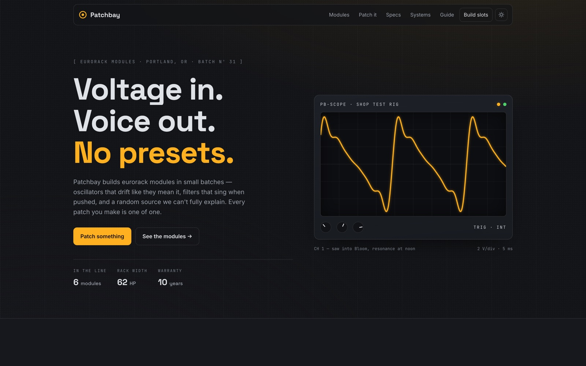

<!-- parable:beautified -->
<div align="center">

<h1>Patchbay</h1>

<p><strong>Eurorack synth maker — drag patch cables between jacks on a module rack, with opt-in Web-Audio tones.</strong></p>

<p>
  <a href="https://bswxyz.github.io/patchbay/"></a>
  
  
  <a href="LICENSE"></a>
</p>

<p>
  <a href="https://bswxyz.github.io/patchbay/"><b>Live demo</b></a>
  &nbsp;·&nbsp;
  <a href="https://bswxyz.github.io/patchbay/guide/">Build notes</a>
  &nbsp;·&nbsp;
  <a href="https://parable-three.vercel.app/templates">More templates</a>
</p>

<a href="https://bswxyz.github.io/patchbay/">
  
</a>

</div>

**Use this template** — copy the source into a new project:

```bash
npx degit bswxyz/patchbay my-app
```


A small-batch eurorack maker whose homepage is a synthesizer — drag real patch cables between
jacks and make the rack sing. Part of the [Parable design showcase](https://parable-three.vercel.app).

---

## The concept

Patchbay is a fictional Portland maker of eurorack modules: an oscillator that drifts "just
enough", a filter that pushes back, a random source they can't fully explain. The brand's whole
argument — *you wire the instrument; every patch is one of one* — is made by the page itself: a
five-module SVG rack where dragging a cable from `SAW OUT` to `AUDIO IN` behaves like the
hardware. Complete VCO → VCF → VCA → out and the LEDs pulse; enable sound and a Web Audio graph
mirroring the patch hums back. The voice is nerdy-in-a-good-way and waveform-poetic — CV, gates,
HP widths, and a warranty that explicitly covers "the ones you patched wrong."

## Design system

- **Palette:** dark (default) is rack-black `#131417` with silver ink `#dfe2e6`; light is
  panel-silver `#e6e4df` with near-black `#17181c`. Accent is LED amber `#ffb020`, secondary LED
  green `#4fd06a` — both kept as fixed "LED paint" tokens in both themes, while text accents get
  darker twins on light surfaces to keep contrast honest. Tokens flip on `:root[data-theme]`,
  persisted under the `patchbay-theme` localStorage key.
- **Type:** `Space Grotesk` 500/700 (display) · `Inter` 400–600 (body/UI) · `JetBrains Mono`
  (jack labels, HP widths, current draw, prices, statuses — everything a faceplate would print).
- **Signature motion:** the "jack-click" ease `cubic-bezier(.34,1.56,.42,1)` — a plug seating
  home with a little overshoot — plus a smooth companion for reveals. Cables settle with a damped
  bounce and sway idly at ~30 fps. Full `prefers-reduced-motion` fallback: instant cables, zero
  sway, and the scope renders exactly one static frame.

## Stack

- **Vite + vanilla TypeScript.** No framework, no runtime dependencies.
- `src/patchbay.ts` — the flourish: the rack is a data model (modules → jacks/knobs/HP) rendered
  to SVG; cables are quadratic beziers with gravity; completion is a BFS over the patch graph.
- `src/audio.ts` — one Web Audio graph (saw → lowpass → VCA → master, one LFO fanned to cutoff /
  tremolo / vibrato). Created only inside the user's click; starts and defaults to silent.
- `src/scope.ts` — the hero module's canvas oscilloscope: a filtered saw drawn harmonic by
  harmonic, DPR capped at 1.5, ~30 fps, paused off-screen.
- `src/reveal.ts` — IntersectionObserver reveals + counters, gated behind a `.js` class so
  nothing is hidden without JavaScript.
- Google Fonts only; no image files anywhere — every visual is inline SVG, canvas or CSS.

## Running it locally

```bash
git clone https://github.com/bswxyz/patchbay
cd patchbay
npm install
npm run dev        # Vite dev server → http://localhost:5173/patchbay/
npm run build      # typecheck + build → docs/
```

## Structure

```
index.html            the page (semantic sections, .js gate, skip link, theme bootstrap)
styles.css            all styling — both themes' tokens in :root at the top
src/main.ts           page wiring: theme toggle, reveals, scope, panel, demo form
src/patchbay.ts       the draggable patch-cable panel (SVG from data + interactions)
src/audio.ts          the opt-in Web Audio voice that mirrors the patch
src/scope.ts          hero oscilloscope canvas
src/reveal.ts         scroll reveals + animated counters
public/guide/         "how it was built" — self-contained page, copied as-is
public/.nojekyll      keeps GitHub Pages from post-processing docs/
vite.config.ts        base '/patchbay/', outDir 'docs'
```

## Demo vs. real — what a production version would need

Intentionally scoped as a showcase. What's **simulated/static** today:

- **Patchbay does not exist.** Modules, prices, batch numbers, specs and the 48-hour burn-in
  ritual are authored fiction (plausible, but fiction).
- **The build-slot form is a demo.** It validates and confirms in place but sends nothing — a
  real shop needs a backend or form service, plus inventory and batch scheduling behind it.
- **No commerce.** "Hold a slot" buttons scroll to the demo form; a real store needs checkout,
  tax/shipping, and stock states wired to actual production.
- **The audio is a sketch of the signal path,** not a circuit simulation — one saw, one filter,
  one LFO. Real Drift has thru-zero FM; the page does not.

What's **real** and reusable as-is: the data-driven SVG rack (keyboard operable, screen-reader
labelled, with sagging-bezier cables and patch-graph detection), the opt-in Web Audio wiring
pattern, the two-theme token system, and the reduced-motion discipline.

## License

[MIT](LICENSE). Design & build by **Parable**. No photographic or generated
image assets — everything on the page is drawn with code.
